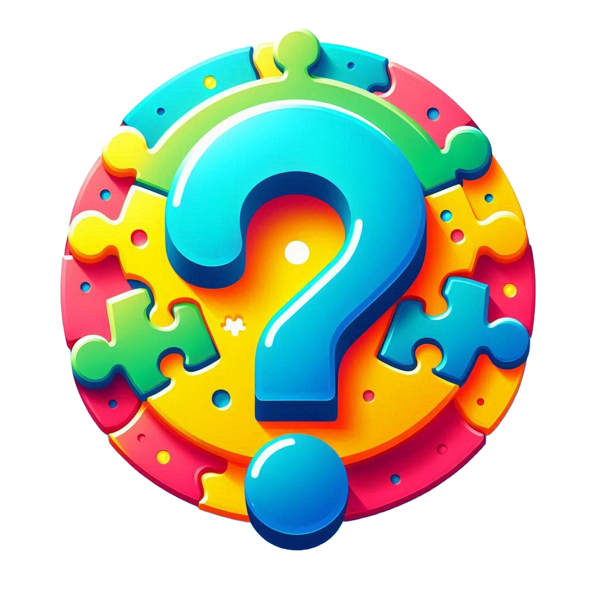

	
	<h1>Quiz Game</h1>

Welcome to the **Quiz Game** App!

This is .NET and Angular project designed to demonstrate a complete fullstack application with complex data relationships.

## Requirements
- [ ] This is an application where you will create and play quiz games.
- [ ] You should create two projects: A .NET WebApi and an Angular app.
- [ ] You can choose whatever database solution you want: Sqlite, SQL server or whatever you're comfortable with.
- [ ] You can choose only use Entity Framework, no other ORM is allowed.
- [ ] Your database should have three tables: Question, Quiz, Game.
- [ ] A question needs to have a Quiz associated with it, hence a foreign key is needed.
- [ ] A game needs to have a Quiz associated with it, hence a foreign key is needed.
- [ ] If a quiz is deleted, all questions and games associated with it need to be deleted.
- [ ] You need to use pagination, which means you can't show any lists or tables longer than the height of the screen.
- [ ] You need to use Angular Material

## Version

This document applies to the QuizGame v0.0.1 development version.

## Contributing

Contributions are not welcome at this time!

## License

This project is licensed under the MIT License. See the [LICENSE](./LICENSE) file for details.

## Contact

For any questions or feedback, please open an issue.

---
***Happy Quiz Gaming!***
